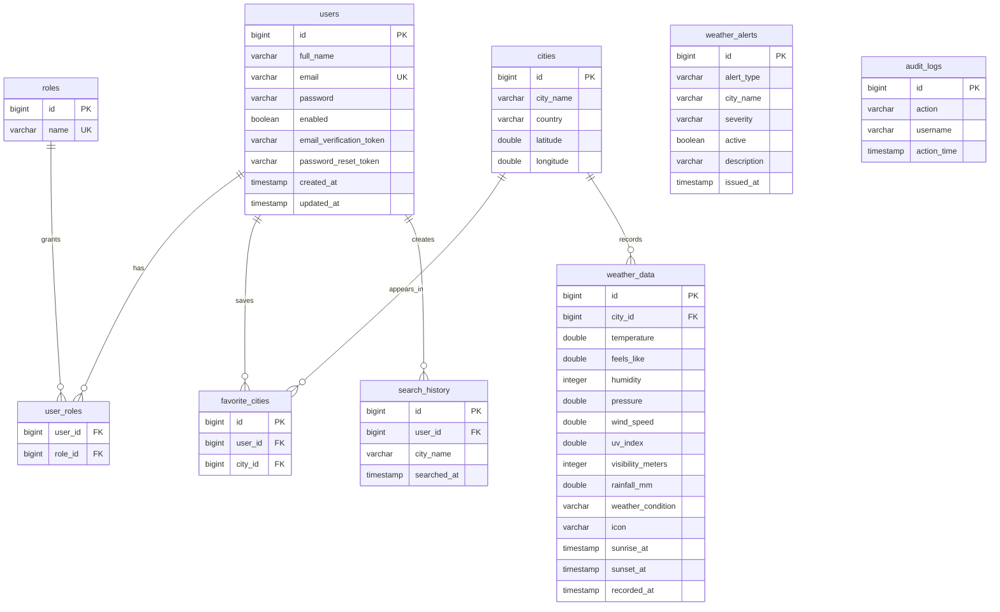

# Database ER Diagram

```mermaid
erDiagram
    users {
        bigint id PK
        varchar full_name
        varchar email UK
        varchar password
        boolean enabled
        varchar email_verification_token
        varchar password_reset_token
        timestamp created_at
        timestamp updated_at
    }

    roles {
        bigint id PK
        varchar name UK
    }

    user_roles {
        bigint user_id FK
        bigint role_id FK
    }

    cities {
        bigint id PK
        varchar city_name
        varchar country
        double latitude
        double longitude
    }

    weather_data {
        bigint id PK
        bigint city_id FK
        double temperature
        double feels_like
        integer humidity
        double pressure
        double wind_speed
        double uv_index
        integer visibility_meters
        double rainfall_mm
        varchar weather_condition
        varchar icon
        timestamp sunrise_at
        timestamp sunset_at
        timestamp recorded_at
    }

    favorite_cities {
        bigint id PK
        bigint user_id FK
        bigint city_id FK
    }

    search_history {
        bigint id PK
        bigint user_id FK
        varchar city_name
        timestamp searched_at
    }

    weather_alerts {
        bigint id PK
        varchar alert_type
        varchar city_name
        varchar severity
        boolean active
        varchar description
        timestamp issued_at
    }

    audit_logs {
        bigint id PK
        varchar action
        varchar username
        timestamp action_time
    }

    users ||--o{ user_roles : has
    roles ||--o{ user_roles : grants
    users ||--o{ favorite_cities : saves
    cities ||--o{ favorite_cities : appears_in
    users ||--o{ search_history : creates
    cities ||--o{ weather_data : records
```
